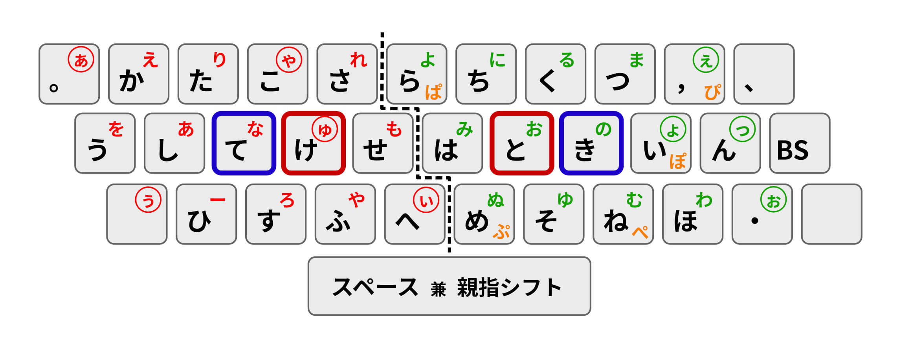

# Nicola-naka

親指シフト（Nicola）を、無変換・変換キーのないUSキーボードでも使えるように、**中指同時シフト + SandS化**したものです。

（なお、中指同時シフト配列の代表例としては、新下駄配列などがあります。その感覚で打てるようになっています。SandSは薙刀式などでも採用されており、キーボード種類を選ばない親指シフトとして用いられています。）

## 設定ファイル

- ＜Windows＞ やまぶきR用
  - [Nicola-naka.yab](Nicola-naka.yab) （**※ UTF-8ではなく、UTF-16LEまたはShift-JISで保存しないと正しく動きません。**）
    - やまぶきRの設定で、**スペースキーを左親指シフトに設定してください。**
      
- ＜Mac＞ Karbiner-Elements用
  - [Nicola-naka.karabiner.json](Nicola-naka.karabiner.json) (Complex modification用です。説明は割愛します。)
 
## 打ち方

- **非シフト面**は親指シフト（Nicola）の定義通りです。
- **濁音**は、**F/J**（人差し指）と反対側のキーを同時押しです。
  - 例えば:
    - J + S の同時押し → 「じ」
    - F + H の同時押し → 「ば」
  - 例外として、J + F の同時押しは「げ」で、 「ど」を打つには、J + K もしくは Q + J の同時押しをします。
- 親指シフト（Nicola）でいう**シフト面**は、**D/K**（中指）と反対側のキーの同時押しです。
  - 例えば:
    - D + J の同時押し → 「お」
    - K + S の同時押し → 「あ」
  - **【例外1】** D + J の同時押しは「で」（濁音で既に使われている）なので、 「お」を打つには、J + L もしくは Z + J の同時押しをします。
  - **【例外2】** D + K の同時押しは「な」で、 「の」を打つには、K + L の同時押しをします。
- **半濁音**は、**F**と反対側のキーの同時押しです。
  - 例えば:
    - F + Y の同時押し → 「ぱ」
    - F + P の同時押し → 「ぴ」
- **SandSでもシフト面を打てるようにしています**。中指同時シフトだけでは打ちにくいシフト面がある際に、左親指シフトをスペースキーに割り当てた上でご利用ください。

## License

CC0 (Public Domain)
